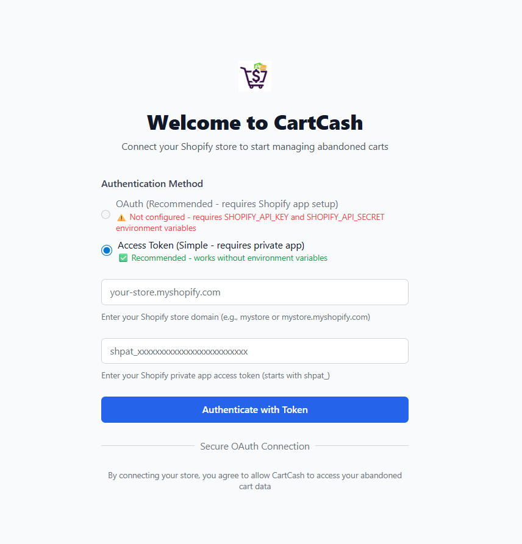

# CartCash - Shopify Abandoned Cart Management

[](https://opensource.org/licenses/Apache-2.0)
[](https://nextjs.org/)
[](https://www.typescriptlang.org/)
[](https://tailwindcss.com/)
[](https://shopify.dev/)

A secure Next.js application for managing Shopify abandoned carts and recover the loss revenue.

## 📸 Screenshots

### Dashboard Overview

*Main dashboard showing abandoned cart analytics and insights*


### Authentication

*Secure Shopify OAuth authentication interface*

## Features

- 🔐 Secure Shopify OAuth authentication
- 📊 Abandoned cart dashboard with analytics
- 🎨 Dark/Light mode support
- 📱 Responsive design
- 📈 CSV export functionality
- 🔄 Real-time cart data
- 📥 Export abandoned cart data to CSV files
- 🚀 **No environment variables required** - Enter credentials directly in the app

## Quick Start

### Installation

```bash
git clone <https://github.com/Unar92/cartcash>
cd cartcash
npm install
npm run dev
```

Open [http://localhost:3000](http://localhost:3000) and enter your Shopify credentials through the web interface.

### Authentication Setup


1. **Access Token (Recommended)** - Create a private app in Shopify admin
2. **OAuth (Advanced)** - Requires Shopify app setup with environment variables

## Development

### Prerequisites

- Node.js 18+
- npm or yarn
- Shopify store with admin access

### Local Development

```bash
# Install dependencies
npm install

# Start development server
npm run dev

# Build for production
npm run build

# Run tests
npm test

# Run linting
npm run lint
```

### Project Structure

```
src/
├── app/                 # Next.js app router
├── components/          # React components
├── providers/          # Context providers
├── utils/              # Utility functions
└── types/              # TypeScript definitions
```


## Support & Feedback

### Getting Help

- 📖 **Documentation**: Check this README and inline code comments
- 🐛 **Bug Reports**: [Open an issue](https://github.com/Unar92/cartcash/issues) with details
- 💡 **Feature Requests**: [Start a discussion](https://github.com/Unar92/cartcash/discussions)
- 💬 **Community**: Join our [Discord community](#) for real-time support

### Reporting Issues

When reporting bugs, please include:

- Steps to reproduce the issue
- Expected vs actual behavior
- Browser and OS information
- Shopify store setup details (if relevant)
- Any error messages or console logs

### Feature Requests

We love hearing your ideas! When suggesting new features:

- Describe the problem you're trying to solve
- Explain how the feature would work
- Provide use cases or examples
- Consider alternative solutions

## Testing

```bash
# Run all tests
npm test

# Run tests in watch mode
npm run test:watch

# Run tests with coverage
npm run test:coverage
```

## Deployment

### Production Deployment

1. Build the application:
   ```bash
   npm run build
   ```

2. Deploy to your preferred platform (Vercel, Netlify, etc.)

### Environment Variables (Optional)

For OAuth authentication in production:
```env
SHOPIFY_API_KEY=your_app_api_key
SHOPIFY_API_SECRET=your_app_secret
NEXT_PUBLIC_APP_URL=https://yourdomain.com
```

## 💰 Support CartCash

Help us maintain and improve CartCash! Your support enables us to:

- 🚀 Add new features and integrations
- 🛠️ Provide ongoing maintenance and bug fixes
- 📚 Create comprehensive documentation
- 🎯 Offer dedicated support for enterprise users

### Ways to Support


##### 💎 Cryptocurrency

[](https://ethereum.org/)
*ETH Address: [0xBa806FE621eCbB67C98e072a4e9374101F52F1bC]*


## License

This project is licensed under the Apache License 2.0 - see the [LICENSE](LICENSE) file for details.

## Acknowledgments

- Built with [Next.js](https://nextjs.org/)
- Styled with [Tailwind CSS](https://tailwindcss.com/)
- Shopify API integration
- Community contributors
